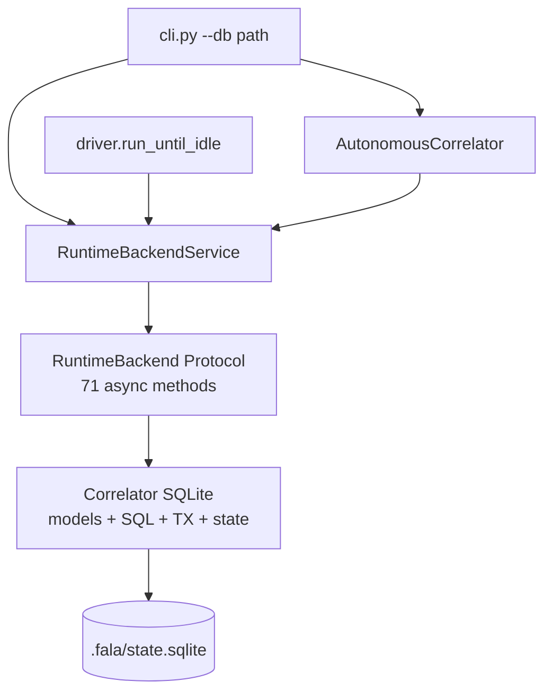
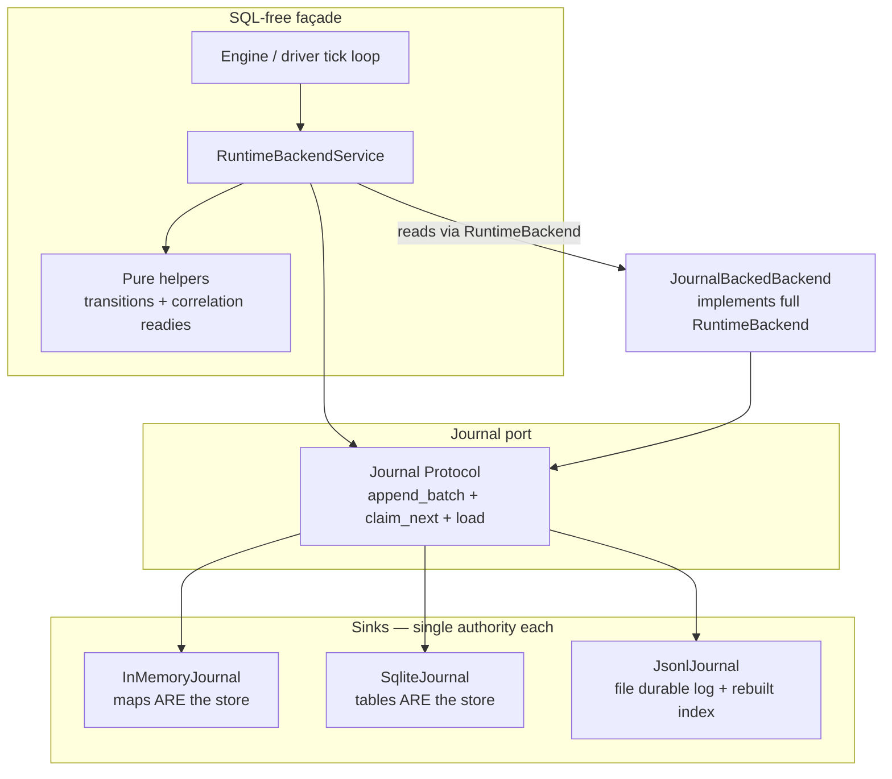
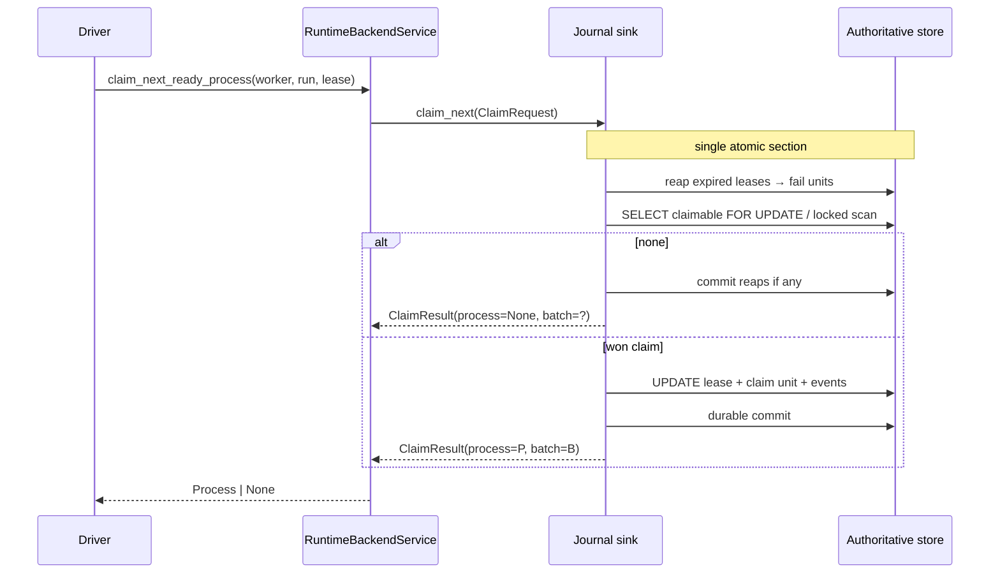
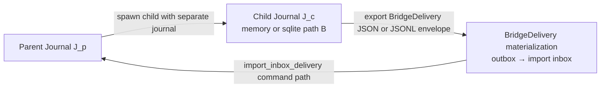
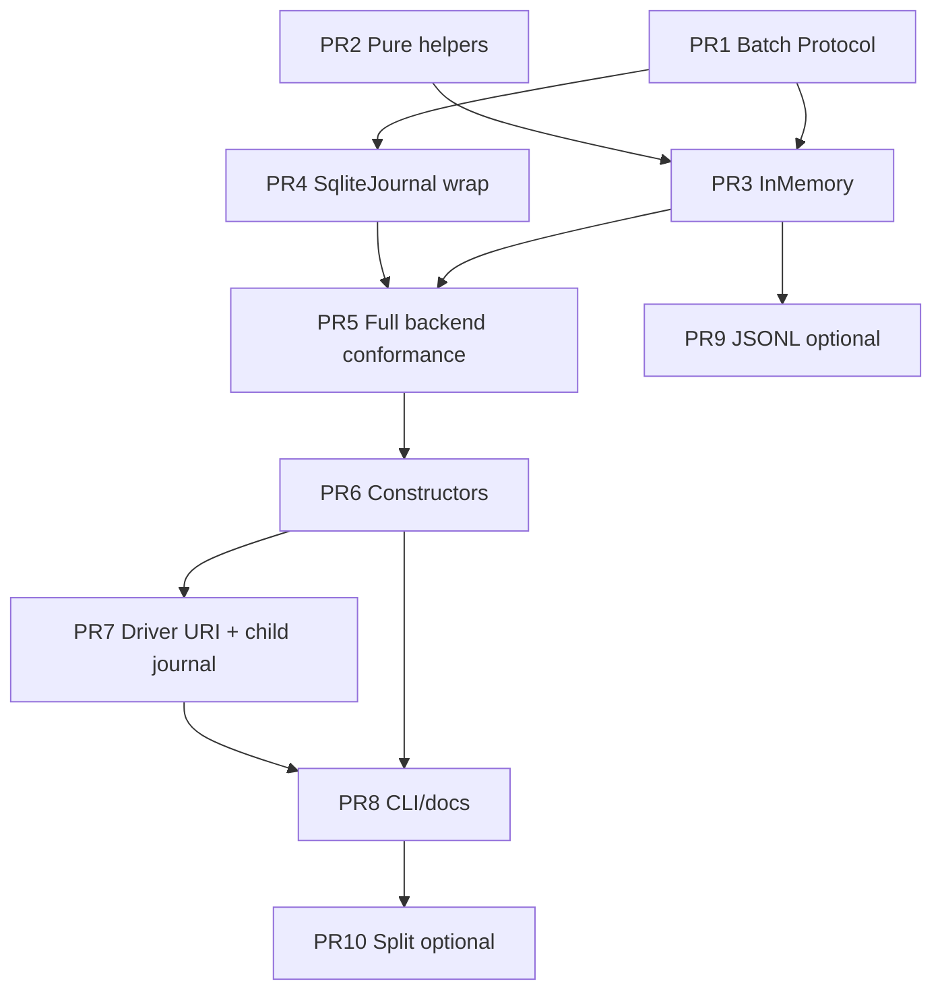

# Event-Stream Core for Fala

| Field | Value |
| --- | --- |
| **Status** | Accepted design (rev 3 — design review complete, 0 open issues) |
| **Author** | Fala architecture discussion |
| **Date** | 2026-07-20 |
| **Path** | [`docs/EVENT_STREAM_CORE.md`](EVENT_STREAM_CORE.md) |
| **Related** | [`RUNTIME.md`](RUNTIME.md), [`SQLITE_BACKEND.md`](SQLITE_BACKEND.md), [`EVENTS_AND_REPLAY.md`](EVENTS_AND_REPLAY.md), [`MULTI_FALA_COMPOSITION.md`](MULTI_FALA_COMPOSITION.md), [`RUNTIME_SEMANTICS.md`](RUNTIME_SEMANTICS.md), [`FALA_ARCHITECTURE_STATUS.md`](FALA_ARCHITECTURE_STATUS.md), [`PROCESS_RUNTIME.md`](PROCESS_RUNTIME.md) |

---

## Overview

Fala today is an **embedded, SQLite-first** runtime. Persistence is hard-wired into the core: `src/fala/runtime_backend.py` (~6990 lines) mixes domain models, the `RuntimeBackend` Protocol (**71** async methods), the SQLite `Correlator`, transactional helpers, and `RuntimeBackendService`. Docs still say **“SQLite-Only Core”** ([`RUNTIME.md`](RUNTIME.md), [`CONCEPTUAL_MODEL.md`](CONCEPTUAL_MODEL.md), [`FALA_ARCHITECTURE_STATUS.md`](FALA_ARCHITECTURE_STATUS.md)).

This couples two unrelated responsibilities:

1. **Graph / process execution & supervision** — what to run, order, stdin/stdout, in-tick state machines  
2. **Persistence of logs and state** — where and how history is written and recovered  

The coupling creates an **architectural risk** under recursion (parent Fala spawning child Fala against a shared `.db`: WAL + `busy_timeout=30000` + process-level `asyncio.Lock` cannot make multi-process writers safe), forced storage location in the public API (`--db`, `AutonomousCorrelator.sqlite`, `RuntimeBackendConfig.kind: Literal["sqlite"]`), and a future path-blocker for a Mojo (or other microscopic) supervisor that should not carry a SQLite driver.

**Proposed direction:** make the core **event-first**. A thin pure engine orchestrates correlation paths and effector I/O; durability is provided by a **Journal port** whose atomic unit is a **multi-command batch** matching today’s `BEGIN IMMEDIATE` transactions (including claim lease-reaping and correlation-path auto-advance). SQLite becomes the **reference sink** behind that port — not the DNA of the binary façade. Existing guarantees (command + event + state atomicity, idempotency, append-only logs, rebuildable projections, bridge records) are preserved at the Journal/sink boundary, not abandoned for fire-and-forget stderr.

Migration is evolutionary: batch Protocol + pure helpers → InMemory → SqliteJournal wrap → full backend conformance → constructors → driver URI → CLI/docs, with JSONL and stream polish off the critical path (see [PR Plan](#pr-plan)).

---

## Background & Motivation

### Current architecture (as implemented)



| Layer | Role today | SQLite coupling |
| --- | --- | --- |
| `AutonomousCorrelator` ([`runtime.py`](../src/fala/runtime.py)) | Embedded facade | `AutonomousCorrelator.sqlite(path)`; reaction-root default uses `isinstance(backend, Correlator)` (~L864) |
| `RuntimeBackendService` | Builds `RuntimeCommand` + `RuntimeEvent`, orchestrates mutations | Talks only to `RuntimeBackend`; factory is `RuntimeBackendService.sqlite(path)` |
| `RuntimeBackend` Protocol | **71** async methods: state CRUD, command/event paths, claim, bridge, vacuum, … | Contract is storage-shaped (put/get/list + transactional mutators) |
| `Correlator` | Sole production backend | `sqlite3`, WAL, `BEGIN IMMEDIATE`, schema v6, append-only triggers |
| `driver.enqueue_fala_runtime_process` | Multi-Fala bridge enqueue | **Hard `isinstance(backend, Correlator)`** (~L405) and `sqlite://` URI |
| CLI | Operator surface | Nearly every command takes `--db` |
| Package schema | `RuntimeBackendConfig` | `kind: Literal["sqlite"]` only |

### Write paths today (two tiers)

| Path | Atomicity | Commands / events | Used by |
| --- | --- | --- | --- |
| **Service command path** (`RuntimeBackendService` → `create_run`, `transition_process`, …) | One SQLite TX: state + command(s) + event(s) | Yes | Production CLI, driver, facade |
| **Backend shortcuts** (`put_*`, `complete_process` / `_finish_process`, `retry_process`, …) | State-only (often **no** command/event) | No | Conformance setup helpers; some internal paths |

[`RUNTIME_SEMANTICS.md`](RUNTIME_SEMANTICS.md) prefers service command paths “where available.” Guarantees listed below apply to the **service command path**. `put_*` are documented separately under [Non-command mutations](#non-command-mutations-put_-and-backend-shortcuts).

### Critical write pattern (single-command TX)

Example: `Correlator.create_run`:

1. `BEGIN IMMEDIATE`
2. Lookup `(run_id, idempotency_key)` → if present, return `CommandSubmission(command=stored, events=[], replayed=True)`  
   (**Today always returns empty `events` on replay** — callers/tests depend on this.)
3. Insert state row(s)
4. Insert `runtime_commands` row
5. `_append_runtime_events` assigns per-run `sequence` and links `command_id`
6. `COMMIT`

### Multi-command TX pattern (must be first-class in Journal)

Today’s atomic unit is **not** always one command. Two production examples:

**1. `claim_next_ready_process`** ([`runtime_backend.py`](../src/fala/runtime_backend.py) ~2510–2701), one `BEGIN IMMEDIATE`:

- For each lease-expired process with `attempt >= max_attempts`: update row → insert `process.fail` command → append `process.failed` event  
- Then select one claimable process under the same lock → update lease → insert `process.claim` → append `process.claimed`  
- N fail commands + 0..1 claim command, **one commit**

**2. `transition_process` success path** (~2955–3080+), one TX:

- Primary command (e.g. `process.complete`) + event + process row update  
- If correlation-path `auto_advance`: additional `process.ready` / `process.readied` (and dead-upstream `process.cancel` / `process.cancelled`) with dependent process updates — **same commit**  
- Explicit later `advance` uses the same idempotency keys so it replays as no-op

Any Journal design that models only `command: RuntimeCommand` (singular) **cannot wrap Correlator honestly**.

### Guards today

- Append-only triggers on `runtime_commands` / `runtime_events` (reject UPDATE/DELETE)
- `UNIQUE (run_id, idempotency_key)` on commands
- Run-scoped command writes reject unknown run ids
- Process claim leases under the same TX + multi-command event emission
- Reaction **bytes** already live outside SQLite (`FileReactionStore`); SQLite holds metadata/refs only ([`SQLITE_BACKEND.md`](SQLITE_BACKEND.md), [`REACTIONS_AND_REFERENCES.md`](REACTIONS_AND_REFERENCES.md))

### Pain points

| Pain | Severity | Evidence |
| --- | --- | --- |
| Recursion / multi-process on one `.db` | High | **Architectural risk** (not a checked-in repro): WAL + `busy_timeout=30000` + single-process `asyncio.Lock` cannot serialize writers across OS processes; parent+child sharing a path is unsafe by construction |
| Forced storage in core API | High | CLI, package schema, driver `fala_runtime`, reaction-root default all assume SQLite path/URI |
| Monolith module | Medium | Models, SQL, service, maintenance, bridge all in one ~7k-line file |
| Multi-Fala composition | Medium | Bridge outbox/inbox between **two SQLite files** ([`MULTI_FALA_COMPOSITION.md`](MULTI_FALA_COMPOSITION.md)) |
| Future Mojo / tiny supervisor | Medium | SQLite driver is heavyweight for a pure supervision core |

### What must not be lost

From [`RUNTIME_SEMANTICS.md`](RUNTIME_SEMANTICS.md) and `tests/runtime_backend_conformance.py` (**service command path** unless noted):

1. **Atomic multi-command batches** where Correlator uses them (claim reaps + claim; complete + auto-ready/cancel) — not only single command+event+state  
2. **Idempotent commands** (same key → replay, no double state change; **replay returns `events=[]`**)  
3. **Append-only** command/event history  
4. **Ordered events** with per-run `sequence` and `command_id` linkage  
5. **Projection rebuild** from state/events (`projection.rebuild` / `run_summary`)  
6. **Bridge inbox/outbox** durability for multi-Fala  
7. **Reaction bytes outside the journal**  
8. **Process claim/lease** semantics: select+mutate under one atomic section (no TOCTOU under multi-worker sinks)  
9. **Full `RuntimeBackend` read surface** for CLI/driver/conformance (71 methods remain implementable)

---

## Goals & Non-Goals

### Goals

1. **SQL-free façade / pure engine surface**: process supervision orchestration, correlation-path advance pure helpers, stdin/stdout wiring, emission of journal batches — **no** `.db` path and **no** `sqlite3` import in the engine façade modules. SqliteJournal remains in-tree as a sink.  
2. **Journal port** as the sole **durable command-path** contract: atomic `append_batch`, first-class `claim_next`, optional ack, `load` for crash recovery, idempotency lookup.  
3. **SQLite remains** as the **reference sink** (default local install).  
4. **InMemory sink** for tests and recursion without files; **JSONL** as optional audit/pipe sink (not critical-path for claim under multi-worker).  
5. **Recursive composition**: child Fala uses a **separate** journal; parent imports via **bridge-compatible** path; **zero shared DB file**.  
6. **Evolutionary migration**: gate on **full** `assert_runtime_backend_conformance`, not journal-only unit tests.  
7. **Docs shift**: “SQLite-first core” → “event-first core, SQLite reference sink”.

### Non-Goals

1. Deleting SQLite or demoting it from default local install in v1.  
2. Replacing the Impulse ontology or command/event type vocabulary.  
3. Network transports (NATS/Kafka/HTTP) as core.  
4. Full CQRS / multi-node consensus.  
5. Moving reaction bytes into the event stream.  
6. Hard-breaking CLI (`--db` stays as alias).  
7. Implementing the Mojo supervisor (only remove the architectural blocker).  
8. Pure event-sourcing with no materialized entity tables in phase A–B.

### Minimum pure `Engine` surface (success criterion for “pure core”)

The future micro-supervisor only needs this SQL-free surface. Everything else may remain sink-adjacent until a later module split.

| API | Role |
| --- | --- |
| `claim_next(...)` | Via Journal (atomic in sink) |
| `complete` / `fail` / `wait` / `retry` / `cancel` / `timeout` process | Service → `append_batch` |
| `accept_impulse`, `schedule_process`, correlation advance helpers | Service / pure helpers |
| `list_events` / read process+impulse for effector input | Via `RuntimeBackend` / QueryStore reads |
| Effector adapter run (stdin/stdout, work_dir) | Driver — no persistence |

**Success criterion:** “event-stream core done” means Journal port + SqliteJournal + InMemory + full backend conformance + driver/constructor de-hardcoding of SQLite — **not** that `runtime_backend.py` is fully split (that is optional follow-up).

---

## Proposed Design

### Target topology



### Separation of concerns

| Concern | Owner | Forbidden in pure façade |
| --- | --- | --- |
| Tick loop, claim → execute → complete | Driver + service | Direct SQL / `.db` construction |
| Status transition matrices, correlation readies | Pure Python helpers (extracted) | Persistence |
| Command/event construction | `RuntimeBackendService` | Direct `sqlite3` |
| Durability, ordering, multi-command atomicity, claim CAS | **Journal** | — |
| Materialized tables / CLI inspect | **Sink** (authoritative store) | Required by façade |
| Reaction blob I/O | `ReactionStore` (unchanged) | — |

---

### Journal batch model (atomic unit)

The durability unit is a **`JournalBatch`**: zero or more **command units** committed together, matching one Correlator `BEGIN IMMEDIATE`…`COMMIT`.

```python
from __future__ import annotations

from collections.abc import Sequence
from datetime import datetime
from typing import Any, Protocol
from pydantic import BaseModel, ConfigDict, Field

from fala.runtime_backend import (  # interim import location
    Process,
    RuntimeCommand,
    RuntimeEvent,
)


class StateFact(BaseModel):
    """Materialized entity change applied in the same atomic batch as its unit.

    ``body`` is a full entity snapshot after the op for ``upsert`` (replace, not
    deep-merge). Keys identify the row. See Recovery for apply rules.
    """

    model_config = ConfigDict(extra="forbid")

    entity: str
    # run | impulse | impulse_type | impulse_relation | association | reaction |
    # process | homeostat | projection | bridge_outbox | bridge_inbox |
    # runtime_pool | delegation_policy
    op: str  # "upsert" | "delete"
    key: dict[str, str]
    body: dict[str, Any] = Field(default_factory=dict)


class CommandUnit(BaseModel):
    """One append-only command with its linked events and materialization facts."""

    model_config = ConfigDict(extra="forbid")

    command: RuntimeCommand
    events: list[RuntimeEvent] = Field(default_factory=list)
    facts: list[StateFact] = Field(default_factory=list)


class JournalBatch(BaseModel):
    """Atomic durability unit — may contain N CommandUnits (N >= 1 for append_batch).

    Examples:
    - create_run: 1 unit
    - claim_next result: 0..K fail units + 0..1 claim unit (built *inside* claim_next)
    - transition_process complete + auto-advance: 1 + M ready/cancel units
    """

    model_config = ConfigDict(extra="forbid")

    journal_seq: int | None = None  # assigned by journal on accept
    run_id: str
    units: list[CommandUnit] = Field(min_length=1)

    # Composition metadata (optional; parent merge / multi-Fala)
    stream_id: str | None = None
    parent_stream_id: str | None = None
    parent_process_id: str | None = None


class AppendResult(BaseModel):
    model_config = ConfigDict(extra="forbid")

    batch: JournalBatch
    replayed: bool = False
    # On replayed=True: events lists are empty (match Correlator today).
    # On replayed=False: events carry assigned sequence + command_id.
    units: list[CommandUnit] = Field(default_factory=list)


class ClaimRequest(BaseModel):
    model_config = ConfigDict(extra="forbid")

    worker_id: str
    run_id: str | None = None
    lease_seconds: float = 300.0
    all_runs: bool = False


class ClaimResult(BaseModel):
    model_config = ConfigDict(extra="forbid")

    process: Process | None
    batch: JournalBatch | None = None  # None when no process claimed and no reaps
    # When reaps happened but nothing claimed, batch may be non-None with only fails
    replayed: bool = False


class Journal(Protocol):
    """Durable command-path port. Each sink is the single authority for its data."""

    @property
    def runtime_uri(self) -> str:
        """e.g. sqlite:///abs/path, memory://local, jsonl:///abs/path.journal.jsonl"""
        ...

    async def append_batch(self, batch: JournalBatch) -> AppendResult:
        """Atomically accept the batch or return prior replay.

        Idempotency:
        - Primary key for replay decision: the **first** unit's
          ``(run_id, command.idempotency_key)``.
        - If the leading key exists: return ``replayed=True``, do not mutate,
          primary unit events are empty (parity with today).
        - InMemory: apply **all** units (sequences, command index, facts) in
          one lock; if a non-leading key exists while leading does not, abort
          (corrupt partial history).
        - SqliteJournal: use **leading unit only** as input to the Correlator
          TX method; non-leading units are ignored as inputs (Correlator
          regenerates side effects). ``AppendResult.units`` may be synthesized
          post-TX from the command/event log.

        Multi-command durability is one atomic commit — same as Correlator TX.
        """
        ...

    async def claim_next(self, request: ClaimRequest) -> ClaimResult:
        """Select + mutate under the sink's atomic section (no TOCTOU).

        Semantics match Correlator.claim_next_ready_process:
        1. Under sink lock / BEGIN IMMEDIATE: reap expired leases (fail units).
        2. Select next claimable process; if none, commit reaps only (if any).
        3. Else claim with lease; append claim unit; commit entire batch.
        4. Return process snapshot after claim, plus the committed batch.

        Core/driver **must not** pre-select a process id then append for
        multi-worker sinks. Single-worker embeds may still call claim_next
        (recommended) so behavior stays uniform.
        """
        ...

    async def get_command_by_idempotency(
        self, *, run_id: str, idempotency_key: str
    ) -> RuntimeCommand | None: ...

    async def list_events(
        self,
        *,
        run_id: str,
        after_sequence: int | None = None,
        impulse_id: str | None = None,
        limit: int | None = None,
    ) -> list[RuntimeEvent]: ...

    async def load(
        self,
        *,
        run_id: str | None = None,
        after_journal_seq: int | None = None,
        limit: int | None = None,
    ) -> list[JournalBatch]:
        """Ordered durable history for recovery / export."""
        ...
```

#### Why batches (not multi-fact only)

| Correlator TX | JournalBatch.units |
| --- | --- |
| `create_run` | `[create unit]` |
| `accept_impulse` | `[accept unit]` |
| `claim_next` reaps + claim | `[fail₁…failₖ, claim?]` — **built inside `claim_next`**, not by core pre-select |
| `transition_process` complete + auto-advance | `[complete, ready₁…readyₘ, cancel₁…cancelₙ]` |
| `enqueue_outbox_delivery` | `[enqueue unit]` |

Idempotency remains **per command**. Batch replay uses the **primary (leading) service command key**; side-effect keys (`process.ready:{id}`, `process.cancel:{id}:dead`, `process.fail:{id}:{attempt}`) are deterministic so a later explicit advance is a no-op.

---

### Authority model (one per sink — no dual-write)

| Sink | Authoritative store | Working set | Multi-worker claim |
| --- | --- | --- | --- |
| **SqliteJournal** | SQLite tables | None required; optional **read-through cache** invalidated on every successful batch/claim (never a second writer) | Yes (`BEGIN IMMEDIATE`) |
| **InMemoryJournal** | Process-local maps under one `asyncio.Lock` | **The maps themselves** — there is no separate `RuntimeState` copy | Single process only (document; multi-process → use SQLite) |
| **JsonlJournal** | Append-only file (durability) + **rebuilt in-memory index** on open | Index is rebuilt from file; mutations only via journal methods that append then update index under one lock | Single process only |

**Forbidden:** select from a stale memory cache, then `append_batch` that mutates a different authority (classic dual-write / TOCTOU).

**Service read path:** always read through `RuntimeBackend` methods that hit the sink’s authoritative store (or a cache filled from it under the same lock as the last mutation).

**On `replayed=True`:** service re-reads entities from the backend (as `RuntimeBackendService` does today for run status / process transitions) — it does not “align” a divergent private map.

**Long-lived process:** after durable success, the sink’s own maps/tables already include the mutation (apply-inside-append). There is no second apply step after ack. Crash mid-append is handled by write barriers (see Recovery).

---

### Claim semantics (first-class)



**Single-worker memory/jsonl:** same API; lock is process-local.  
**Multi-worker production:** only SqliteJournal (or a future lock service) is supported for claim.

CAS-append (facts with expected status) is **not** the v1 claim design; it may be explored later for exotic sinks. v1 = **claim_next inside the journal**.

---

### Facts vs command dispatch (materialization strategy)

Two layers, not two competing PR4 strategies:

| Layer | Role |
| --- | --- |
| **Command-type handlers** (existing Correlator methods) | Validate transitions, compute side-effect units (auto-ready/cancel), enforce budgets |  
| **`apply_facts` / table writers** | Persist the entity snapshots the handler decided |

**Decision (revisitable after PR5):**

1. **Extract pure helpers** (PR2): transition matrices, `compute_correlation_path_readies` / dead cancellations already in `correlation_paths.py`, lease-reap eligibility — no I/O.  
2. **Handlers own policy**; they produce a `JournalBatch` (list of `CommandUnit`s with facts).  
3. **Shared `apply_facts(store, facts)`** mutates an abstract store Protocol used by InMemory.  
4. **SqliteJournal multi-unit `append_batch` input contract (normative for PR4/PR5):**  
   - **Leading unit only is input** to the matching Correlator TX method (`command_type` of `units[0]` + its command/events/facts as that method already expects).  
   - **Non-leading units are not applied by the caller path.** Correlator **regenerates** side-effect commands/events internally (auto-ready, dead-cancel, claim reaps via `claim_next`).  
   - Callers / `JournalBackedBackend` **may** attach non-leading units on the batch for documentation or InMemory parity tests; SqliteJournal **ignores them as write inputs**. After the TX, SqliteJournal may **synthesize** the full unit list (including side effects) onto `AppendResult.units` from the command/event log for `load`/export symmetry.  
   - **Conformance:** command logs after a multi-effect operation must match InMemory (deterministic idempotency keys). Optional strict mode: if the caller supplied non-leading keys, assert they equal the keys Correlator actually inserted (or are a subset); mismatch → test failure, not silent double-apply.  
   - **`claim_next`:** never takes a pre-built multi-unit batch from the caller; the sink builds reaps+claim entirely inside the atomic section.  
   - **Phase later:** SQL writers may apply the same pure snapshots facts represent without Correlator-internal regeneration.

For **InMemoryJournal**, handlers pre-build **all** units (primary + side effects) via pure helpers; `append_batch` applies **every** unit through command index + `apply_facts` under one lock. This is **not** a second ad hoc Correlator — shared pure helpers + shared batch shape are the contract; PR2 is a prerequisite.

**Facts are required on the batch model** for non-SQL sinks and for export/replay of materialization intent. SqliteJournal PR4 may populate facts from post-state rows when wrapping existing methods so `load` is uniform.

---

### QueryStore and JournalBackedBackend

There is **no separate vague QueryStore type** in the public façade. The read+mutation surface remains **`RuntimeBackend` (71 methods)**.

```python
class JournalBackedBackend:
    """Implements the full RuntimeBackend Protocol.

    - Mutating *command-path* methods build JournalBatch (or call journal.claim_next)
      and delegate to Journal.
    - Read methods (get_*, list_*, diagnose, rebuild_projections without command, …)
      read the sink's authoritative store.
    - put_* : see Non-command mutations.
    """

    def __init__(self, journal: Journal) -> None:
        self.journal = journal
        # SqliteJournal embeds Correlator tables; InMemory embeds maps.
        # journal exposes internal store access only to this adapter.

    @property
    def runtime_uri(self) -> str:
        return self.journal.runtime_uri
```

| RuntimeBackend category | Journal interaction |
| --- | --- |
| `create_run`, `accept_impulse`, `transition_*`, `schedule_process`, `record_*`, bridge enqueue/deliver/import, `save_*`, `rebuild_projections_with_command`, `submit_command` | → `append_batch` |
| `claim_next_ready_process` | → `journal.claim_next` |
| `get_*` / `list_*` / wait diagnostics | → authoritative store reads |
| `vacuum`, `delete_run`, retention helpers | → sink-specific admin (SQLite); InMemory implements best-effort; JSONL may no-op or rewrite |
| `put_*` | → [Non-command mutations](#non-command-mutations-put_-and-backend-shortcuts) |

`AutonomousCorrelator` interim shape:

```python
class AutonomousCorrelator:
    def __init__(self, backend: RuntimeBackend) -> None:
        # Unchanged primary constructor — driver/CLI keep working.
        self.service = RuntimeBackendService(backend)
        self.backend = backend

    @classmethod
    def sqlite(cls, path: str | Path) -> AutonomousCorrelator:
        """Deprecated shim → from_journal(SqliteJournal(path))."""
        ...

    @classmethod
    def from_journal(cls, journal: Journal) -> AutonomousCorrelator:
        backend = JournalBackedBackend(journal)
        return cls(backend)

    @property
    def runtime_uri(self) -> str:
        j = getattr(self.backend, "journal", None)
        if j is not None:
            return j.runtime_uri
        if isinstance(self.backend, Correlator):  # deprecation window
            return f"sqlite://{self.backend.path.expanduser().resolve()}"
        return "unknown://"
```

**`isinstance(Correlator)` call sites to eliminate** (PR7 scope):

| Location | Current use |
| --- | --- |
| [`driver.py`](../src/fala/driver.py) ~405 | `fala_runtime` requires Correlator |
| [`runtime.py`](../src/fala/runtime.py) ~864 | default reaction root beside SQLite path |

---

### Non-command mutations (`put_*` and backend shortcuts)

| Method class | Journaled? | Decision |
| --- | --- | --- |
| `put_run`, `put_impulse`, `put_process`, … (13 `put_*`) | **No** by default | **Test/admin bypass** on the authoritative store; used heavily by `assert_runtime_backend_conformance` setup. Document as non-audit path. Production CLI/service must not call them for business mutations. |
| `complete_process` / `fail_process` / `retry_process` / `_finish_process` without service | **No** today | **Deprecate for production** in favor of service `transition_process` / complete helpers that emit commands. JournalBackedBackend may keep them as store-only for conformance parity during migration, with a warning flag in doctor. |
| Service command methods | **Yes** | Sole durable business path |

**Journal conformance** tests command-path + claim + load.  
**Backend conformance** remains the full 71-method bar including `put_*`.

---

### Mapping: service operations → batches

See [Appendix A](#appendix-a--command--event--fact-matrix) for the full matrix. Summary of multi-unit cases:

| Service / backend method | Batch units (order) |
| --- | --- |
| `create_run` | `run.create` |
| `transition_run` / cancel | `run.status.set` or `run.cancel` |
| `accept_impulse` | `impulse.accept` |
| `claim_next_ready_process` | `process.fail`×N + `process.claim`? (**via `claim_next`**) |
| `transition_process` → succeeded | `process.complete` + `process.ready`×M + `process.cancel`×K (auto) |
| `transition_process` → waiting | `process.wait` |
| `transition_process` → retry_wait | `process.retry` |
| bridge enqueue / deliver / import | matching bridge.* unit |
| `rebuild_projections_with_command` | `projection.rebuild` |

---

### Recovery & Replay Semantics

#### Idempotent re-append (normative)

Match Correlator:

```text
if leading idempotency key exists:
    return AppendResult(replayed=True, units=[{command: stored, events: [], facts: []}...])
    # events ALWAYS empty on replay — do not re-list historical events here
```

Callers that need events after replay use `list_events`.

#### Fact apply rules

```text
function apply_facts(store, facts):
  for fact in facts:  # order preserved within unit; units in batch order
    assert fact.op in {"upsert", "delete"}
    assert fact.entity in KNOWN_ENTITIES
    key = normalize_key(fact.entity, fact.key)  # requires run_id where scoped
    if fact.op == "delete":
      store.delete(fact.entity, key)
    else:
      # REPLACE full body — not deep-merge
      validate_entity_schema(fact.entity, fact.body)
      store.upsert(fact.entity, key, fact.body)
```

Unknown run_id on run-scoped entities: reject at **handler** layer before append (same as `_require_run_row`).

#### Load algorithm (pseudo-code)

```text
function recover(journal) -> Store:
  store = empty_store()
  batches = journal.load(after_journal_seq=None)  # durable order
  for batch in batches:
    for unit in batch.units:
      # Re-insert command index (idempotency map)
      store.index_command(unit.command)
      for event in unit.events:
        store.append_event_raw(event)  # sequences already assigned
      apply_facts(store, unit.facts)
  # Lease reap is NOT done during load — only on subsequent claim_next
  return store
```

**SQLite load:** tables are already materializations; `load()` reconstructs `JournalBatch` list for export/debug from `runtime_commands` + `runtime_events` (+ optional `journal_records`). **Authoritative runtime state after crash = tables**, not a fact replay (facts must be consistent with tables when both present; if `journal_records` exists and disagrees with tables, **tables win** and doctor warns).

**InMemory / JSONL load:** rebuild maps solely via `recover` above.

#### JSONL write barrier (`every_record` durability)

```text
function jsonl_append_batch(batch):
  line = json_dumps(batch) + "\n"
  # Crash-safe:
  # 1. write to "{path}.partial" (or use O_APPEND with single write syscall for line)
  # 2. fsync partial file
  # 3. rename partial → durable only if using side file; for O_APPEND:
  #    write full line in one write(); fsync(fd)
  # On open: if last line fails JSON parse → truncate torn line, continue
  update_in_memory_index(batch)  # only after durable barrier
```

Required conformance: **crash-injection** — kill after fsync (batch visible), kill mid-line (batch absent, no torn parse).

#### Lease recovery

Expired-lease failure is **part of `claim_next`**, not of `load`/`recover`. After restart, the next claim_next reaps. Matches Correlator.

#### Projection rebuild

- **Table path (SQLite today):** `_build_run_summary_projection(connection, run_id)` from current tables; command path wraps with `projection.rebuild` unit.  
- **Journal path:** either rebuild from authoritative store entities (same as today) or scan events — **v1 keeps table/entity rebuild**, not pure event reduce. Event-only rebuild is phase C.

---

### Event schema (core→world contract)

Existing `RuntimeEvent` fields stay the public shape ([`runtime_backend.py`](../src/fala/runtime_backend.py) L224–239):

| Field | Role |
| --- | --- |
| `id` | Stable event id |
| `run_id` | Run scope |
| `event_type` | Vocabulary ([Appendix A](#appendix-a--command--event--fact-matrix)) |
| `schema_version` | Payload evolution |
| `sequence` | Per-run order (**assigned at journal accept**, not by caller) |
| `command_id` | Link to causing command |
| `impulse_id` / `process_id` | Optional scopes |
| `actor` / `correlation_id` / `causation_id` | Audit lineage |
| `payload` | Typed-by-convention dict |
| `created_at` | Wall time |

**Per-run `sequence`** remains primary for event order. Optional file-global `journal_seq` on `JournalBatch` for JSONL/export.

Wire format (JSONL line):

```text
{"v":1,"kind":"journal_batch","journal_seq":…,"run_id":"…","units":[…]}
```

---

### Recursive composition / multi-Fala (v1 concrete path)

**v1 default: stream is transport; bridge command types remain the semantic merge.**

Do **not** re-emit remapped child events into the parent run in v1 (deferred).



#### APIs (v1)

```python
async def export_bridge_delivery(
    source: RuntimeBackendService,
    *,
    run_id: str,
    delivery_id: str,
) -> BridgeDelivery:
    """Existing semantic object; may be serialized as JSON file or one JSONL batch
    whose single unit is bridge.outbox.deliver / export envelope."""
    ...

async def import_child_bridge(
    parent: RuntimeBackendService,
    delivery: BridgeDelivery,
    *,
    actor: str | None = None,
) -> tuple[Impulse, CommandSubmission]:
    """Runs existing import_inbox_delivery command path (budget checks, impulse accept)."""
    ...

# In-process recursion helper
async def run_child_in_process(
    *,
    parent: AutonomousCorrelator,
    parent_process: Process,
    child_package: ...,
) -> BridgeDelivery:
    child_journal = InMemoryJournal()  # NEVER parent sqlite path
    child = AutonomousCorrelator.from_journal(child_journal)
    # ... create child run, accept impulse, run_until_idle ...
    return build_bridge_delivery_from_child(parent, parent_process, child)
```

| Concern | v1 rule |
| --- | --- |
| `stream_id` | Optional metadata on export envelope; default `child.run_id` |
| Id remapping | Child keeps its own `run_id`; parent stores impulse + bridge rows, not child event sequences |
| Budget / policy | Enforced on parent enqueue and import (existing `_validate_bridge_budget` / consume) |
| Child crash mid-run | Parent effector stays `waiting`; `close_delegations` unchanged (observes child `RunBoundary`) |
| Subprocess | Child process gets own `--db` or `--journal memory` via IPC; parent never opens child DB for writes; handoff via file/stdout bridge JSON |
| `stream.merged` events | **Deferred** (PR optional); not required for v1 |
| Privileged facts from child | **Rejected** on import — only bridge/impulse payload path, not raw `StateFact` injection into parent pools/policies |

#### PR split

- **PR7:** remove `isinstance(Correlator)` + `runtime_uri`; in-process child with separate InMemory + bridge import test  
- **PR9 (optional):** JSONL pipe framing, `stream.opened/closed`, subprocess supervisor helpers  

---

### Sinks (summary)

#### InMemoryJournal

- Maps under `asyncio.Lock`; implement `append_batch`, `claim_next`, `load`, reads for JournalBackedBackend  
- Single-process only  
- Full backend conformance required before calling InMemory “done”

#### JsonlJournal (off critical path)

- Durable log + rebuilt index; claim single-process only  
- Tee: `TeeJournal(primary=Sqlite|Memory, audit=Jsonl)` optional  

#### SqliteJournal

- Thin wrap of Correlator TX methods in PR4; exposes Journal Protocol  
- Tables authoritative; schema v6 preserved; optional additive `journal_records` later  
- Maintenance/GC/vacuum remain **SQLite-only** admin APIs  

---

### CLI / package config

```yaml
# Preferred
runtime:
  journal:
    kind: sqlite   # memory | jsonl | sqlite
    path: .fala/state.sqlite

# Still accepted (alias)
runtime:
  backend:
    kind: sqlite
    path: .fala/state.sqlite
```

| Phase | Flags |
| --- | --- |
| After PR6 | `--journal` / `--journal-path`; `--db` alias |
| Docs | PR8 |

### Doctor / operability per sink

| Sink | `fala doctor` |
| --- | --- |
| sqlite | Existing schema/table checks + optional journal_records consistency warn |
| memory | Report `runtime_uri`, entity counts, “non-durable” warning |
| jsonl | File exists, parse all lines, report torn-line repair, sequence gaps |
| tee | Doctor both legs |

GC / vacuum / reaction GC: **SQLite only**; other sinks error with “unsupported”.

Archive / export-bundle: export **commands+events stream** (portable); include `journal_records` only as optional SQLite-specific section.

---

## API / Interface Changes

### Public constructors

```python
# Preferred
journal = open_journal(kind="sqlite", path=".fala/state.sqlite")
runtime = AutonomousCorrelator.from_journal(journal)
assert runtime.backend  # JournalBackedBackend — driver keeps using .service

# Deprecated shim
AutonomousCorrelator.sqlite(path)
```

### `runtime_uri`

Defined on `Journal` and exposed via `JournalBackedBackend` / `AutonomousCorrelator` for bridge `RuntimeRef.uri` (replaces hard-coded `sqlite://{Correlator.path}`).

### Service mutation path

```python
# Claim — selection stays inside the journal sink
result = await self.backend.claim_next_ready_process(...)  # → journal.claim_next

# Ordinary command path: primary unit is what the service built for the caller op.
# Side-effect units (auto-ready / dead-cancel):
#   - InMemoryJournal: JournalBackedBackend pre-builds them via pure helpers and
#     append_batch applies all units.
#   - SqliteJournal: only units[0] is input; Correlator regenerates side effects
#     inside the TX (see “SqliteJournal multi-unit append_batch input contract”).
batch = JournalBatch(
    run_id=...,
    units=[CommandUnit(command=primary_cmd, events=[primary_event], facts=[...])],
)
append = await self.journal.append_batch(batch)

# CommandSubmission exposes the *primary* command only — match Correlator today
# (transition_process returns stored_events for the caller-supplied primary
# events, not auto-ready events written in the same TX).
primary = append.units[0]
submission = CommandSubmission(
    command=primary.command,
    events=[] if append.replayed else list(primary.events),
    replayed=append.replayed,
)
# Full batch (including side-effect units) is available on append.units for
# journal-aware callers / load / export — never folded into CommandSubmission.
```

For multi-unit success responses, service methods that today return a single `CommandSubmission` continue to expose the **primary** command’s submission only (`units[0].events`, empty when `replayed`). Side-effect commands remain inspectable via `list_commands` / `list_events` (same as today after auto-advance). Do **not** flatten all batch events into `CommandSubmission.events`.

---

## Data Model Changes

### SQLite

**No mandatory break in PR4.** Optional later:

```sql
CREATE TABLE IF NOT EXISTS journal_records (
    journal_seq INTEGER PRIMARY KEY AUTOINCREMENT,
    run_id TEXT NOT NULL,
    primary_command_id TEXT NOT NULL,
    record_json TEXT NOT NULL,
    created_at TEXT NOT NULL,
    UNIQUE (run_id, primary_command_id)
);
```

Schema version 6 → 7 only when this table ships. **Tables remain authoritative** if both exist.

### Package config

`JournalConfig` + `backend` alias (see above).

---

## Alternatives Considered

### A. Keep SQLite in core; only improve locking

Minimal change; does not enable memory-only tests or micro-supervisor; recursion still tempted to share paths. **Rejected** as primary strategy.

### B. Pure event sourcing from day one

Clean long-term; blocks decoupling for months. **Deferred** to phase C.

### C. stderr / OTEL fire-and-forget only

Breaks idempotency, atomicity, replay. **Rejected.**

### D. Big-bang delete RuntimeBackend

Unreviewable. **Rejected.**

### E. File-split + RuntimeBackend stays the durability boundary; journal as export/tee only

**Approach:** Split `runtime_backend.py` for maintainability; enforce “child never shares parent DB” as policy; optional JSONL audit tee of events without redefining writes; keep `RuntimeBackend` as the write API forever.

| Pros | Cons |
| --- | --- |
| Low dual-write risk; ships faster | Core still SQL-shaped; InMemory tests still need a second full backend or SQLite temp files |
| Recursion lock risk reduced by policy alone | Micro-supervisor still depends on full RuntimeBackend+SQL semantics |
| No batch/claim redesign | Does not make sinks interchangeable |

**Why Journal port still preferred:** interchangeable InMemory (fast conformance + recursion), one place to put claim atomicity for non-SQL sinks, and a real boundary for a future Mojo engine that only speaks batches+claim. **Sequencing note:** pure-helper extraction (PR2) and optional mechanical file split can land **before** or **with** Journal without adopting tee-only as the end state.

---

## Security & Privacy Considerations

| Topic | Notes |
| --- | --- |
| Local trust | Journals inherit today’s single-tenant file trust ([`SECURITY.md`](SECURITY.md)) |
| JSONL / pipe | Authenticated only by OS process identity / filesystem permissions — **not** a network security boundary |
| Child merge validation checklist | (1) Pydantic-validate `BridgeDelivery` / envelope; (2) enforce `RuntimeBudget` / `DelegationPolicy`; (3) max records / max payload bytes on import; (4) reject child-supplied `runtime_pool` / `delegation_policy` / parent `run_id` spoofing in metadata; (5) **no raw `StateFact` apply from child into parent store** — only bridge import command path; (6) strip unknown envelope fields |
| PII | Impulse payloads may be sensitive; JSONL is plaintext — document mode `0600` parity with SQLite files |
| Idempotency | Unchanged local trust model |

---

## Observability

| Signal | How |
| --- | --- |
| Append / claim latency | Per sink kind |
| Replay rate | `journal_append_replayed_total` |
| Batch size | Histogram of units per batch (detect claim reap storms) |
| Sequence gaps | Doctor + load assert contiguous per run |
| Sink errors | Fail the tick; no silent drop |
| Doctor | Per-sink behavior above |

---

## Rollout Plan

| Stage | Default | Rollback |
| --- | --- | --- |
| Protocol + pure helpers | No behavior change | Revert |
| InMemory + full conformance | Opt-in tests | Revert |
| SqliteJournal wrap | Still default SQLite | Correlator class remains |
| Constructors / URI | Shims keep `.sqlite()` | Revert warnings |
| Driver | URI provider | Restore isinstance temporarily |
| CLI `--journal` | `--db` alias forever for one minor+ | — |

---

## Risks

| Risk | Severity | Mitigation |
| --- | --- | --- |
| Batch model mismatch with Correlator | High | PR4 acceptance: multi-command TX parity tests (claim reaps, auto-ready atomic) |
| Claim TOCTOU | High | `claim_next` only; forbid select-then-append for multi-worker |
| Dual-write drift | High | Single authority per sink; no post-ack second apply |
| InMemory reimplements Correlator | High | Shared pure helpers + full backend conformance gate |
| PR4 scope creep | Medium | Thin dispatch wrap only; no SQL rewrite |
| JSONL not multi-worker safe | Medium | Document; don’t use as production claim store |

---

## Open Questions

Resolved interim decisions are in [Key Decisions](#key-decisions). Remaining:

1. ~~**When to require facts population on SqliteJournal wrap?**~~  
   **Resolved (2026-07-20):** defer fact synthesis on SqliteJournal until **after PR5** (full `assert_runtime_backend_conformance` green). PR4 is a thin dispatch wrap without requiring `StateFact` population.

2. **Msgpack codec timeline?** After JSONL optional PR.

3. **Rename `RuntimeJournalMaintenancePlan` → sink maintenance?** Cosmetic; after docs PR.

---

## Key Decisions

| Decision | Rationale | Revisit |
| --- | --- | --- |
| **Atomic unit = `JournalBatch` of N `CommandUnit`s** | Matches claim reaps + correlation auto-advance multi-command TXes | Only if Correlator stops batching (unlikely) |
| **`claim_next` is a first-class Journal op** | Prevents TOCTOU; selection stays inside sink atomic section | CAS-append only if a sink cannot implement claim |
| **Single authority per sink; no dual-write RuntimeState** | Preserves transactional guarantees under concurrency | — |
| **SqliteJournal PR4 = dispatch leading unit only; Correlator regenerates side-effect units** | Honest wrap without rewriting SQL; avoids double-apply of pre-built ready/cancel units; facts/full units synthesized for load | Full fact-driven SQL writers later |
| **`CommandSubmission` = primary unit only** | Match Correlator service return shape; side effects via list_commands/list_events | — |
| **Shared pure transition/correlation helpers extracted first** | InMemory parity without forked policy | — |
| **`RuntimeBackend` remains public read+mutation façade (71 methods)** | CLI/driver/conformance continuity; Journal sits under JournalBackedBackend | Split Query port after stabilization |
| **`put_*` stay non-journaled test/admin bypass** | Conformance relies on them; not the business audit path | — |
| **Idempotent replay returns empty events** | Match Correlator + existing tests | — |
| **v1 multi-Fala merge = bridge-compatible import; no event remapping** | Concrete, reuses budget/policy; defers stream.merged complexity | Optional stream PR |
| **Child never shares parent journal path** | Eliminates shared-DB lock class by construction | — |
| **JSONL off critical path for multi-worker claim** | File scan + single-process lock insufficient for fleets | — |
| **Facts required on batch model; SQLite synthesizes facts only after PR5** | Non-SQL sinks need materialization; PR4 stays a thin Correlator dispatch without fact population | Revisit load symmetry after conformance gate |
| **Full `assert_runtime_backend_conformance` gates JournalBackedBackend** | Journal unit tests alone are insufficient | — |
| **“Pure core done” ≠ file split complete** | Engine surface SQL-free; monolith split optional | PR10 |
| **Reject stderr-only; keep reaction bytes outside journal** | Product + existing architecture | — |
| **Deprecate, don’t hard-break `--db` / `.sqlite()`** | Operator continuity | — |
| **Open Q: facts public?** Yes, versioned on batch | Needed for InMemory/export | After PR5 |
| **Open Q: global vs per-run seq** | Keep per-run event sequence; optional batch `journal_seq` | — |
| **Open Q: in-process vs subprocess** | Both; in-process InMemory first; subprocess uses separate journal + bridge file | — |

---

## References

- Source: [`src/fala/runtime_backend.py`](../src/fala/runtime_backend.py) — `RuntimeEvent`, `RuntimeCommand`, `RuntimeBackend` (71 methods), `Correlator.create_run`, `claim_next_ready_process` multi-command TX, `transition_process` auto-advance, `_append_runtime_events`, `RuntimeBackendService`  
- Source: [`src/fala/runtime.py`](../src/fala/runtime.py) — `AutonomousCorrelator`; `isinstance(Correlator)` reaction root ~L864  
- Source: [`src/fala/driver.py`](../src/fala/driver.py) — `run_until_idle`, `enqueue_fala_runtime_process` ~L405, `close_delegations`  
- Source: [`src/fala/correlation_paths.py`](../src/fala/correlation_paths.py) — `compute_correlation_path_readies`, dead cancellations  
- Source: [`src/fala/models.py`](../src/fala/models.py) — `RuntimeBackendConfig`  
- Tests: [`tests/runtime_backend_conformance.py`](../tests/runtime_backend_conformance.py)  
- Docs: [`SQLITE_BACKEND.md`](SQLITE_BACKEND.md), [`EVENTS_AND_REPLAY.md`](EVENTS_AND_REPLAY.md), [`MULTI_FALA_COMPOSITION.md`](MULTI_FALA_COMPOSITION.md), [`RUNTIME_SEMANTICS.md`](RUNTIME_SEMANTICS.md), [`PROCESS_RUNTIME.md`](PROCESS_RUNTIME.md)

---

## Appendix A — Command ↔ event ↔ fact matrix

Primary pairs from `RuntimeBackendService` builders + Correlator side-effect commands.

| command_type | event_type(s) | Primary facts (entity upsert) | Notes |
| --- | --- | --- | --- |
| `run.create` | `run.created` | `run` | Single unit |
| `run.status.set` | `run.status.changed` | `run` | |
| `run.cancel` | `run.cancel_requested` | `run` | status → cancel_requested |
| `impulse_type.register` | `impulse_type.registered` | `impulse_type` | |
| `impulse.accept` | `impulse.accepted` | `impulse` | |
| `impulse_relation.record` | `impulse_relation.recorded` | `impulse_relation` | |
| `association.record` | `association.recorded` | `association` | |
| `reaction.record` | `reaction.recorded` | `reaction` | bytes out of band |
| `process.schedule` | `process.scheduled` | `process` | |
| `process.claim` | `process.claimed` | `process` | From **claim_next** only |
| `process.fail` | `process.failed` | `process` | Lease reap inside claim_next; also service fail |
| `process.complete` | `process.completed` | `process` | May batch with ready/cancel |
| `process.wait` | `process.waiting` | `process` | |
| `process.retry` | `process.retry_scheduled` | `process` | |
| `process.ready` | `process.readied` | `process` | Auto-advance side unit |
| `process.cancel` | `process.cancelled` | `process` | Service or dead-upstream side unit |
| `process.timeout` | `process.timed_out` | `process` | |
| `homeostat.save` / `homeostat.open` | `homeostat.saved` / `homeostat.opened` | `homeostat` | |
| `homeostat.complete` | `homeostat.completed` | `homeostat` | |
| `homeostat.cancel` | `homeostat.cancelled` | `homeostat` | |
| `homeostat.expire` | `homeostat.expired` | `homeostat` | |
| `projection.save` | `projection.saved` | `projection` | |
| `projection.rebuild` | `projection.rebuilt` | `projection`×names | |
| `bridge.outbox.enqueue` | `bridge.outbox.enqueued` | `bridge_outbox` | Budget consume in TX |
| `bridge.outbox.deliver` | `bridge.outbox.delivered` | `bridge_outbox` | |
| `bridge.inbox.import` | `bridge.inbox.imported` | `bridge_inbox` + often impulse unit in same service flow | Import path also accepts impulse |

**Batch examples**

| Scenario | units[].command_type order |
| --- | --- |
| Claim with 2 reaps + 1 claim | `process.fail`, `process.fail`, `process.claim` |
| Complete with 2 auto-ready | `process.complete`, `process.ready`, `process.ready` |
| Complete with dead cancel | `process.complete`, `process.cancel` |

---

## PR Plan

Each PR is independently reviewable. **Gate:** JournalBackedBackend (or Correlator shim) stays green on **full** `assert_runtime_backend_conformance` once introduced. JSONL is **not** on the critical path before Sqlite wrap.

### PR1 — Journal batch Protocol + claim sketch

| | |
| --- | --- |
| **Title** | `feat(journal): JournalBatch, CommandUnit, Journal Protocol with claim_next` |
| **Files** | `src/fala/journal/types.py`, `src/fala/journal/protocol.py`, exports, model unit tests |
| **Depends on** | — |
| **Description** | Normative types: `StateFact`, `CommandUnit`, `JournalBatch`, `AppendResult`, `ClaimRequest`, `ClaimResult`, `Journal` with `append_batch`, `claim_next`, `load`, `runtime_uri`. Document multi-command + replay-empty-events semantics. No production call sites. |

### PR2 — Extract pure transition / correlation helpers (behavior-neutral)

| | |
| --- | --- |
| **Title** | `refactor(runtime): extract pure process transition and claim eligibility helpers` |
| **Files** | New `src/fala/runtime_pure.py` (or expand `correlation_paths.py`); call from Correlator without behavior change; tests for pure functions |
| **Depends on** | — (can parallelize with PR1) |
| **Description** | Move/isolate transition matrix checks, lease-reap eligibility, and ensure correlation readies/cancels are pure. **No Journal yet.** Unblocks honest InMemory handlers. |

### PR3 — InMemoryJournal + claim + journal conformance

| | |
| --- | --- |
| **Title** | `feat(journal): InMemoryJournal with append_batch, claim_next, recover` |
| **Files** | `src/fala/journal/memory.py`, `tests/journal_conformance.py` (batch, multi-command, claim reaps, crash N/A, replay empty events), apply_facts tests |
| **Depends on** | PR1, PR2 |
| **Description** | Single-lock maps as sole authority. Implement claim reaps + claim. Multi-unit complete+ready simulated via helpers. |

### PR4 — SqliteJournal thin wrap (dispatch to Correlator TX)

| | |
| --- | --- |
| **Title** | `refactor(sqlite): SqliteJournal Protocol wrap over existing Correlator transactions` |
| **Files** | `src/fala/journal/sqlite.py` or methods on Correlator; map `append_batch` primary command_type → existing methods; `claim_next` → `claim_next_ready_process`; journal conformance on SQLite |
| **Depends on** | PR1 (PR2/PR3 for shared tests) |
| **Description** | **No SQL rewrite.** `append_batch` maps **leading** `command_type` → existing Correlator TX method; **non-leading units are ignored as inputs** (Correlator regenerates side effects). `claim_next` → `claim_next_ready_process`. Acceptance: multi-command parity tests (auto-ready still atomic; claim reaps still same commit); command-log key parity vs InMemory. **No StateFact population in PR4** (deferred until after PR5). Correlator class remains. |

### PR5 — JournalBackedBackend green on full backend conformance

| | |
| --- | --- |
| **Title** | `feat(journal): JournalBackedBackend passes assert_runtime_backend_conformance` |
| **Files** | `JournalBackedBackend`; wire put_* to store; service may call journal when backend exposes it; `tests/test_runtime_backend_conformance.py` parametrize memory + sqlite journal backends |
| **Depends on** | PR3, PR4 |
| **Description** | **Hard gate.** InMemory and Sqlite journal-backed backends pass the **full** 71-method conformance suite (including put_* behavior). Fix gaps before any façade deprecation. |

### PR6 — Constructors, config alias, runtime_uri

| | |
| --- | --- |
| **Title** | `feat(runtime): from_journal(), open_journal(), JournalConfig; deprecate path-only as primary` |
| **Files** | `runtime.py`, `models.py`, `__init__.py`, package YAML alias support |
| **Depends on** | PR5 |
| **Description** | `AutonomousCorrelator.from_journal`, `open_journal`, `runtime.journal` config with `backend` alias. `.sqlite()` shim. Expose `runtime_uri`. **Do not** claim pure modules have zero `sqlite3` until split — only façade preferred path is journal-based. |

### PR7 — Driver: drop Correlator isinstance; bridge URI; in-process child journal

| | |
| --- | --- |
| **Title** | `feat(driver): runtime_uri for fala_runtime; separate child journal; no Correlator hard-dep` |
| **Files** | `driver.py`, `runtime.py` reaction-root (~864), tests for in-process child InMemory + bridge import |
| **Depends on** | PR6 |
| **Description** | Remove both `isinstance(Correlator)` sites. Source URI from `runtime_uri`. Child uses separate InMemoryJournal; parent imports via existing bridge path. **No** full pipe protocol / stream.merged. |

### PR8 — CLI + docs

| | |
| --- | --- |
| **Title** | `docs+cli: event-first core; --journal alongside --db; EVENT_STREAM_CORE.md` |
| **Files** | `cli.py`, README, RUNTIME.md, CONCEPTUAL_MODEL.md, FALA_ARCHITECTURE_STATUS.md, this doc, cross-links |
| **Depends on** | PR6 (PR7 for composition accuracy preferred) |
| **Description** | `--journal` / `--journal-path`; `--db` alias; doctor notes per sink; maintenance SQLite-only. |

### PR9 (optional) — JsonlJournal + tee + pipe handoff

| | |
| --- | --- |
| **Title** | `feat(journal): JsonlJournal, write barriers, optional TeeJournal` |
| **Files** | `journal/jsonl.py`, crash-injection tests, optional bridge JSONL envelope |
| **Depends on** | PR3 |
| **Description** | Off critical path; parallelizable after PR3. Not required for PR4–PR8. |

### PR10 (optional) — Module split / stream.merged polish

| | |
| --- | --- |
| **Title** | `refactor: split runtime_backend monolith; optional stream.merged` |
| **Depends on** | PR8 |
| **Description** | Mechanical maintainability; not a success criterion for event-stream core. |

### Dependency graph


